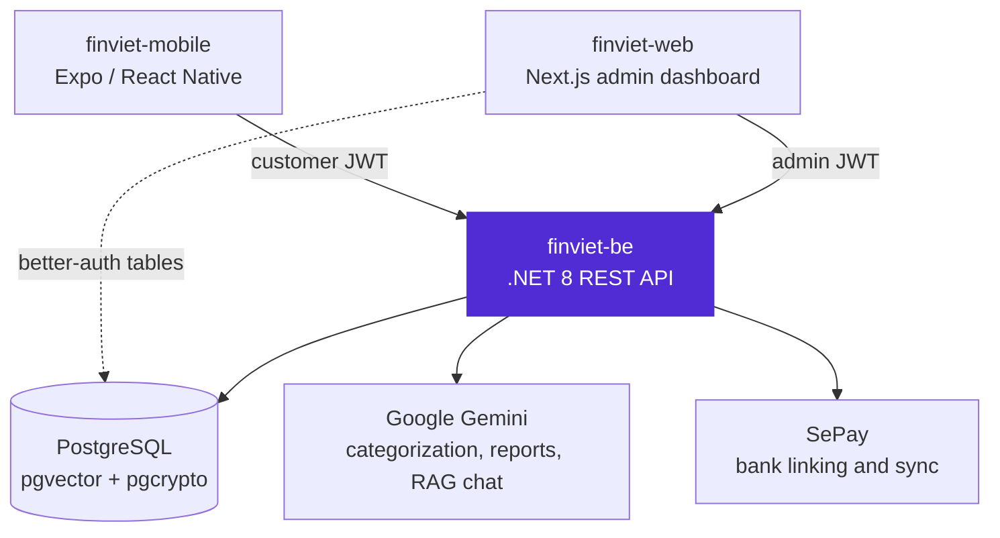

<p align="center">
  
</p>

<h1 align="center">FinViet API</h1>

<p align="center">
  The .NET 8 backend for FinViet, a personal-finance app for the Vietnamese market: a REST API over
  PostgreSQL with Gemini-backed transaction categorization, weekly reports, and a
  retrieval-augmented chatbot.
</p>

<p align="center">
  <a href="https://github.com/FinViet-Capstone/finviet-be/actions/workflows/deploy-render.yml"></a>
  
  
  
  
</p>

## What it does

FinViet lets people track spending across multiple wallets, budget against a needs/wants/savings split, and save toward goals. This repository owns the data model, authentication, business rules, and every external integration behind that.

Transactions can enter four ways: typed in manually, parsed from a bank SMS, extracted from a receipt photo, or imported from a bank CSV export. The API parses each one, applies the customer's merchant-keyword rules, then falls back to a Gemini call to suggest a category. It also links real bank accounts through SePay for automatic transaction sync, and serves the analytics and configuration endpoints the admin dashboard runs on.

## Part of FinViet

FinViet is three repositories:

| Repo | Role |
| --- | --- |
| [finviet-be](https://github.com/FinViet-Capstone/finviet-be) | This repo. The API and database that power both clients. |
| [finviet-mobile](https://github.com/FinViet-Capstone/finviet-mobile) | Expo / React Native app. The customer-facing product. |
| [finviet-web](https://github.com/FinViet-Capstone/finviet-web) | Next.js admin dashboard. Internal operations and system configuration. |



## Features

- **Authentication** — email and password with email verification, Google sign-in, JWT access and refresh tokens, a separate admin login path, and forgot, reset, and change password flows.
- **Wallets and transactions** — manual wallets alongside SePay-linked bank wallets, wallet-to-wallet transfers written as a paired debit and credit that delete and reverse together, `SELECT ... FOR UPDATE` row locking on every balance-mutating operation, and `Idempotency-Key` replay protection on transaction creation, goal contributions, and transfers.
- **Multi-method entry extraction** — `POST /extract/sms`, `/extract/csv`, and `/extract/photo` parse their input and return structured fields without persisting anything, so a client can show a review step before the customer commits.
- **Categorization** — 19 system categories mapped into needs, wants, and savings buckets, per-customer category sets and custom categories, and customer-defined merchant-keyword rules that are checked before any AI call.
- **Budgets** — per-category monthly limits with safe, warning, and danger thresholds, plus bucket-level pacing that compares actual spend against the fraction of the month elapsed.
- **Savings goals** — named goals with a target, an optional deadline, and an optional funding wallet, with guarded contribute and withdraw operations and a derived required monthly saving.
- **AI suite, read-only by design** — a spending score, an AI-labeled weekly report, and a multi-session chatbot answering over a pgvector knowledge base. The chat path has no access to mutation handlers, the idempotency store, or Gemini tool execution.
- **Admin surface** — customer management, the category and bucket catalog, spending-score weighting criteria, announcements, chatbot knowledge-base documents, AI prompt configuration, and subscription plans.
- **Background work** — a hosted weekly-report scheduler, plus a guarded one-shot command for regenerating every RAG embedding after an embedding-model change.

Full endpoint inventory: [docs/api-reference.md](docs/api-reference.md).

## Tech stack

.NET 8 and ASP.NET Core Web API, Clean Architecture across four projects (`Api`, `Application`, `Infrastructure`, `Domain`). MediatR for CQRS, FluentValidation as a pipeline behavior, EF Core with Npgsql. PostgreSQL with the `vector` and `pgcrypto` extensions. DbUp for versioned SQL migrations. Google.GenAI for Gemini generation and embeddings. JWT bearer authentication. xUnit for tests. A Docker image, GitHub Actions for build and unit tests, deployed to Render.

## Getting started

### Prerequisites

- .NET 8 SDK
- PostgreSQL with the `vector` and `pgcrypto` extensions available. The [pgvector/pgvector](https://hub.docker.com/r/pgvector/pgvector) image ships both.
- A Google Gemini API key. This is not optional: `Gemini:ApiKey` is validated at startup and the API refuses to boot without it.

### Configure and run

No connection string or API key is checked into the repository. Supply both through user secrets:

```bash
dotnet restore FinViet.sln
dotnet user-secrets --project src/FinViet.Api set "ConnectionStrings:DefaultConnection" "Host=localhost;Port=5432;Database=finviet;Username=postgres;Password=yourpassword"
dotnet user-secrets --project src/FinViet.Api set "Gemini:ApiKey" "your-gemini-key"
dotnet run --project src/FinViet.Api
```

The API listens on `http://localhost:5122`, with Swagger UI at `/swagger`. Schema migrations and reference data run automatically on startup, so there is no separate migrate step. To authorize in Swagger, paste the raw `accessToken` with no `Bearer ` prefix.

Gemini configuration and the embedding re-index runbook are in [docs/gemini-setup.md](docs/gemini-setup.md). Database bootstrap, backup, and restore procedures are in [docs/database-bootstrap.md](docs/database-bootstrap.md).

### Tests

```bash
dotnet test tests/FinViet.Domain.UnitTests
dotnet test tests/FinViet.Application.UnitTests
```

Both suites run without a database. The integration suite in `tests/FinViet.Api.IntegrationTests` calls a real running server rather than `WebApplicationFactory`, so start the API first. If no server is reachable, the suite skips itself instead of failing.

## Design notes

A few decisions that are deliberate rather than accidental, since they read as deviations otherwise:

- **DbUp, not EF Core Migrations.** Schema changes are hand-written, immutable, numbered SQL scripts applied in order on startup, recorded in a `schema_versions` table, and serialized across instances by a PostgreSQL advisory lock. Released scripts are never edited, only appended to. This keeps the schema reviewable as plain SQL and safe to apply from more than one instance.
- **EF entities live in Infrastructure, not Domain.** The schema was scaffolded from a real database, and moving scaffolded entities into Domain would have bought a cleaner layering diagram at the cost of a duplicate mapping layer. `Domain` holds enums today.
- **One global exception middleware.** Handlers throw typed exceptions and the middleware maps each to a status code. Business-rule failures carry a stable string code that the clients branch on for localized messages, so no controller formats its own error response.
- **The chatbot cannot write.** Read-only access is enforced by what is injected into the chat flow, not by prompt instructions.

## Limitations and what's next

- **Integration tests do not run in CI.** They need a live server and a seeded database, so the GitHub Actions workflow builds and runs the Domain and Application unit suites only. Getting them into CI means a containerized Postgres plus a deterministic seed step.
- **Subscriptions are half a feature.** Plans and customer subscriptions are modeled and admin-manageable, but no payment provider is wired up and there is no customer-facing purchase endpoint, so the mobile app cannot surface it.
- **Routes are unversioned.** That works while both clients ship in step with the API. It becomes a problem the first time a released mobile build has to keep working against a changed contract.
- **Deployment is a single instance.** Merges to `main` build, unit test, and deploy straight to one Render service. There is no staging environment in between.

## How this was built

This is a team capstone project. Development ran through a spec-driven workflow: each repository keeps a `context/` directory holding the living project specification, coding standards, and the feature currently in progress, plus a `CLAUDE.md` that encodes the repository's real conventions for AI coding assistants. Features were written into that specification before implementation, and the specification was corrected whenever the code turned out to disagree with it. That is why the notes above name deviations instead of hiding them.

## License

MIT. See [LICENSE](LICENSE).
