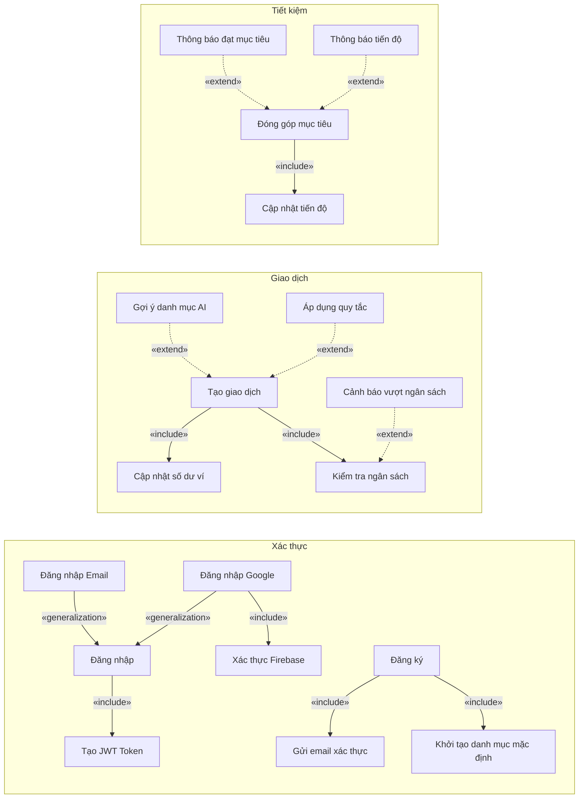

# Tổng Quan Use Case - Hệ Thống FinViet

## 1. Mô tả hệ thống

**FinViet** là hệ thống quản lý tài chính cá nhân thông minh, hỗ trợ người dùng theo dõi thu chi, lập ngân sách, đặt mục tiêu tiết kiệm, liên kết tài khoản ngân hàng, và sử dụng trí tuệ nhân tạo (AI) để phân tích chi tiêu.

---

## 2. Danh sách Actor

| Actor | Loại | Mô tả |
|-------|------|--------|
| **Người dùng (User)** | Primary | Người dùng đã đăng ký tài khoản, sử dụng ứng dụng để quản lý tài chính |
| **Khách (Guest)** | Primary | Người chưa đăng nhập, chỉ có thể đăng ký / đăng nhập |
| **Quản trị viên (Admin)** | Primary | Quản trị hệ thống, duyệt yêu cầu danh mục, quản lý người dùng |
| **Hệ thống Sepay** | Secondary | Hệ thống bên thứ ba gửi webhook khi có giao dịch ngân hàng |
| **Google Firebase** | Secondary | Hệ thống xác thực bên thứ ba (đăng nhập Google) |
| **Google Gemini AI** | Secondary | Dịch vụ AI phân tích chi tiêu, trích xuất giao dịch, trò chuyện tài chính |
| **Hệ thống Email** | Secondary | Dịch vụ gửi email xác thực, đặt lại mật khẩu |
| **Hệ thống nền (Scheduler)** | Secondary | Background job chạy định kỳ (báo cáo tuần, cảnh báo ngân sách) |

### Quan hệ Generalization giữa các Actor

```
          ┌────────┐
          │ Khách  │
          │(Guest) │
          └───┬────┘
              │ «generalization»
              ▼
       ┌──────────────┐
       │  Người dùng  │
       │   (User)     │
       └──────┬───────┘
              │ «generalization»
              ▼
       ┌──────────────┐
       │ Quản trị viên│
       │   (Admin)    │
       └──────────────┘
```

> **Giải thích**: Admin kế thừa tất cả quyền của User. User kế thừa quyền đăng ký/đăng nhập của Guest và có thêm các quyền quản lý tài chính.

---

## 3. Use Case Diagram Tổng Quan (Mermaid)

```mermaid
graph TB
    subgraph Actors
        Guest["🧑 Khách (Guest)"]
        User["👤 Người dùng (User)"]
        Admin["👨‍💼 Quản trị viên (Admin)"]
        Sepay["🏦 Hệ thống Sepay"]
        Firebase["🔥 Google Firebase"]
        GeminiAI["🤖 Google Gemini AI"]
        EmailSys["📧 Hệ thống Email"]
        Scheduler["⏰ Scheduler"]
    end

    subgraph "UC-Auth: Xác thực & Phân quyền"
        UC_Register["Đăng ký tài khoản"]
        UC_Login["Đăng nhập"]
        UC_GoogleLogin["Đăng nhập Google"]
        UC_Logout["Đăng xuất"]
        UC_ForgotPwd["Quên mật khẩu"]
    end

    subgraph "UC-Wallet: Quản lý Ví"
        UC_ManageWallet["Quản lý ví"]
        UC_Transfer["Chuyển tiền giữa các ví"]
    end

    subgraph "UC-Transaction: Quản lý Giao dịch"
        UC_ManageTx["Quản lý giao dịch"]
        UC_ImportCSV["Nhập giao dịch từ CSV"]
        UC_ExtractTx["Trích xuất giao dịch (AI)"]
    end

    subgraph "UC-Budget: Ngân sách"
        UC_ManageBudget["Quản lý ngân sách"]
    end

    subgraph "UC-SavingGoal: Tiết kiệm"
        UC_ManageGoal["Quản lý mục tiêu tiết kiệm"]
    end

    subgraph "UC-AI: Trợ lý AI"
        UC_AiChat["Trò chuyện với AI"]
        UC_AiAnalysis["Phân tích chi tiêu AI"]
    end

    subgraph "UC-Admin: Quản trị"
        UC_ApproveCat["Duyệt yêu cầu danh mục"]
    end

    Guest --> UC_Register
    Guest --> UC_Login
    Guest --> UC_GoogleLogin
    User --> UC_ManageWallet
    User --> UC_ManageTx
    User --> UC_ManageBudget
    User --> UC_ManageGoal
    User --> UC_AiChat
    User --> UC_AiAnalysis
    User --> UC_Logout
    Admin --> UC_ApproveCat
    Sepay --> UC_ManageTx
    Firebase --> UC_GoogleLogin
    GeminiAI --> UC_AiChat
    GeminiAI --> UC_AiAnalysis
    GeminiAI --> UC_ExtractTx
    EmailSys --> UC_ForgotPwd
    Scheduler --> UC_ManageBudget
```



---

## 4. Danh sách Use Case theo Module

| Mã UC | Tên Use Case | Actor chính | File mô tả |
|--------|-------------|-------------|------------|
| **UC-AUTH-01** | Đăng ký tài khoản | Guest | [01-uc-auth.md](./01-uc-auth.md) |
| **UC-AUTH-02** | Đăng nhập | Guest | [01-uc-auth.md](./01-uc-auth.md) |
| **UC-AUTH-03** | Đăng nhập bằng Google | Guest | [01-uc-auth.md](./01-uc-auth.md) |
| **UC-AUTH-04** | Làm mới token | User | [01-uc-auth.md](./01-uc-auth.md) |
| **UC-AUTH-05** | Quên mật khẩu | Guest | [01-uc-auth.md](./01-uc-auth.md) |
| **UC-AUTH-06** | Đặt lại mật khẩu | Guest | [01-uc-auth.md](./01-uc-auth.md) |
| **UC-AUTH-07** | Xác thực email | Guest | [01-uc-auth.md](./01-uc-auth.md) |
| **UC-AUTH-08** | Đổi mật khẩu | User | [01-uc-auth.md](./01-uc-auth.md) |
| **UC-AUTH-09** | Đăng xuất | User | [01-uc-auth.md](./01-uc-auth.md) |
| **UC-PROFILE-01** | Xem hồ sơ cá nhân | User | [02-uc-profile.md](./02-uc-profile.md) |
| **UC-PROFILE-02** | Cập nhật hồ sơ | User | [02-uc-profile.md](./02-uc-profile.md) |
| **UC-PROFILE-03** | Tải lên ảnh đại diện | User | [02-uc-profile.md](./02-uc-profile.md) |
| **UC-PROFILE-04** | Xem điểm chi tiêu | User | [02-uc-profile.md](./02-uc-profile.md) |
| **UC-PROFILE-05** | Xóa tài khoản | User | [02-uc-profile.md](./02-uc-profile.md) |
| **UC-PROFILE-06** | Cập nhật gói đăng ký | User | [02-uc-profile.md](./02-uc-profile.md) |
| **UC-WALLET-01** | Tạo ví | User | [03-uc-wallet.md](./03-uc-wallet.md) |
| **UC-WALLET-02** | Xem danh sách ví | User | [03-uc-wallet.md](./03-uc-wallet.md) |
| **UC-WALLET-03** | Cập nhật ví | User | [03-uc-wallet.md](./03-uc-wallet.md) |
| **UC-WALLET-04** | Xóa ví | User | [03-uc-wallet.md](./03-uc-wallet.md) |
| **UC-WALLET-05** | Chuyển tiền giữa ví | User | [03-uc-wallet.md](./03-uc-wallet.md) |
| **UC-WALLET-06** | Tính lại số dư ví | User | [03-uc-wallet.md](./03-uc-wallet.md) |
| **UC-TX-01** | Tạo giao dịch | User | [04-uc-transaction.md](./04-uc-transaction.md) |
| **UC-TX-02** | Xem danh sách giao dịch | User | [04-uc-transaction.md](./04-uc-transaction.md) |
| **UC-TX-03** | Cập nhật giao dịch | User | [04-uc-transaction.md](./04-uc-transaction.md) |
| **UC-TX-04** | Xóa giao dịch | User | [04-uc-transaction.md](./04-uc-transaction.md) |
| **UC-TX-05** | Nhập giao dịch từ CSV | User | [04-uc-transaction.md](./04-uc-transaction.md) |
| **UC-TX-06** | Trích xuất giao dịch từ văn bản | User | [04-uc-transaction.md](./04-uc-transaction.md) |
| **UC-TX-07** | Trích xuất giao dịch từ ảnh | User | [04-uc-transaction.md](./04-uc-transaction.md) |
| **UC-CAT-01** | Xem danh mục | User | [05-uc-category.md](./05-uc-category.md) |
| **UC-CAT-02** | Tạo danh mục tùy chỉnh | User | [05-uc-category.md](./05-uc-category.md) |
| **UC-CAT-03** | Cập nhật danh mục | User | [05-uc-category.md](./05-uc-category.md) |
| **UC-CAT-04** | Xóa danh mục | User | [05-uc-category.md](./05-uc-category.md) |
| **UC-CAT-05** | Yêu cầu danh mục hệ thống | User | [05-uc-category.md](./05-uc-category.md) |
| **UC-CAT-06** | Khởi tạo danh mục mặc định | Admin | [05-uc-category.md](./05-uc-category.md) |
| **UC-BUDGET-01** | Tạo ngân sách | User | [06-uc-budget.md](./06-uc-budget.md) |
| **UC-BUDGET-02** | Xem danh sách ngân sách | User | [06-uc-budget.md](./06-uc-budget.md) |
| **UC-BUDGET-03** | Cập nhật ngân sách | User | [06-uc-budget.md](./06-uc-budget.md) |
| **UC-BUDGET-04** | Xóa ngân sách | User | [06-uc-budget.md](./06-uc-budget.md) |
| **UC-BUDGET-05** | Kiểm tra cảnh báo ngân sách | Scheduler | [06-uc-budget.md](./06-uc-budget.md) |
| **UC-GOAL-01** | Tạo mục tiêu tiết kiệm | User | [07-uc-saving-goal.md](./07-uc-saving-goal.md) |
| **UC-GOAL-02** | Xem mục tiêu tiết kiệm | User | [07-uc-saving-goal.md](./07-uc-saving-goal.md) |
| **UC-GOAL-03** | Cập nhật mục tiêu | User | [07-uc-saving-goal.md](./07-uc-saving-goal.md) |
| **UC-GOAL-04** | Xóa mục tiêu | User | [07-uc-saving-goal.md](./07-uc-saving-goal.md) |
| **UC-GOAL-05** | Đóng góp vào mục tiêu | User | [07-uc-saving-goal.md](./07-uc-saving-goal.md) |
| **UC-GOAL-06** | Rút tiền từ mục tiêu | User | [07-uc-saving-goal.md](./07-uc-saving-goal.md) |
| **UC-LINK-01** | Liên kết tài khoản ngân hàng | User | [08-uc-linked-wallet.md](./08-uc-linked-wallet.md) |
| **UC-LINK-02** | Xem ví liên kết | User | [08-uc-linked-wallet.md](./08-uc-linked-wallet.md) |
| **UC-LINK-03** | Đồng bộ ví liên kết | User | [08-uc-linked-wallet.md](./08-uc-linked-wallet.md) |
| **UC-LINK-04** | Hủy liên kết ví | User | [08-uc-linked-wallet.md](./08-uc-linked-wallet.md) |
| **UC-LINK-05** | Xử lý webhook Sepay | Sepay | [08-uc-linked-wallet.md](./08-uc-linked-wallet.md) |
| **UC-AI-01** | Trò chuyện với AI | User | [09-uc-ai.md](./09-uc-ai.md) |
| **UC-AI-02** | Trò chuyện AI kèm ảnh | User | [09-uc-ai.md](./09-uc-ai.md) |
| **UC-AI-03** | Gợi ý danh mục bằng AI | User | [09-uc-ai.md](./09-uc-ai.md) |
| **UC-AI-04** | Phân loại giao dịch hàng loạt | User | [09-uc-ai.md](./09-uc-ai.md) |
| **UC-AI-05** | Phân tích chi tiêu AI | User | [09-uc-ai.md](./09-uc-ai.md) |
| **UC-AI-06** | Báo cáo chi tiêu tuần | User / Scheduler | [09-uc-ai.md](./09-uc-ai.md) |
| **UC-NOTI-01** | Xem thông báo | User | [10-uc-notification.md](./10-uc-notification.md) |
| **UC-NOTI-02** | Đánh dấu đã đọc | User | [10-uc-notification.md](./10-uc-notification.md) |
| **UC-NOTI-03** | Xóa thông báo | User | [10-uc-notification.md](./10-uc-notification.md) |
| **UC-RULE-01** | Quản lý quy tắc merchant | User | [11-uc-rule.md](./11-uc-rule.md) |
| **UC-RULE-02** | Quản lý quy tắc beneficiary | User | [11-uc-rule.md](./11-uc-rule.md) |
| **UC-ADMIN-01** | Duyệt yêu cầu danh mục | Admin | [12-uc-admin.md](./12-uc-admin.md) |
| **UC-ADMIN-02** | Từ chối yêu cầu danh mục | Admin | [12-uc-admin.md](./12-uc-admin.md) |
| **UC-ADMIN-03** | Xem yêu cầu danh mục chờ duyệt | Admin | [12-uc-admin.md](./12-uc-admin.md) |
| **UC-ADMIN-04** | Khởi tạo danh mục mặc định | Admin | [12-uc-admin.md](./12-uc-admin.md) |

---

## 5. Tổng hợp quan hệ Use Case

### 5.1 Quan hệ Include (Bao gồm)

| Use Case chính | «include» | Use Case được bao gồm |
|---------------|-----------|----------------------|
| Đăng ký tài khoản | → | Gửi email xác thực |
| Đăng ký tài khoản | → | Khởi tạo danh mục mặc định |
| Đăng nhập | → | Tạo JWT Token |
| Đăng nhập Google | → | Xác thực Firebase |
| Đăng nhập Google | → | Tạo JWT Token |
| Quên mật khẩu | → | Gửi email đặt lại mật khẩu |
| Tạo giao dịch | → | Cập nhật số dư ví |
| Tạo giao dịch | → | Kiểm tra ngân sách |
| Xóa giao dịch | → | Cập nhật số dư ví |
| Chuyển tiền giữa ví | → | Tạo giao dịch (giao dịch Transfer) |
| Nhập giao dịch từ CSV | → | Parse file CSV |
| Nhập giao dịch từ CSV | → | Tạo giao dịch (hàng loạt) |
| Trích xuất giao dịch từ ảnh | → | Phân tích ảnh bằng AI |
| Trích xuất giao dịch từ văn bản | → | Phân tích văn bản bằng AI |
| Đóng góp vào mục tiêu | → | Cập nhật tiến độ mục tiêu |
| Liên kết tài khoản ngân hàng | → | Tạo ví liên kết |
| Phân tích chi tiêu AI | → | Truy vấn lịch sử giao dịch |
| Báo cáo chi tiêu tuần | → | Phân tích chi tiêu AI |
| Kiểm tra cảnh báo ngân sách | → | Gửi thông báo |
| Duyệt yêu cầu danh mục | → | Tạo danh mục hệ thống mới |

### 5.2 Quan hệ Extend (Mở rộng)

| Use Case chính | «extend» | Use Case mở rộng | Điều kiện |
|---------------|----------|------------------|-----------|
| Tạo giao dịch | ← | Gợi ý danh mục bằng AI | Khi người dùng chưa chọn danh mục |
| Tạo giao dịch | ← | Áp dụng quy tắc merchant | Khi giao dịch từ bank sync |
| Tạo giao dịch | ← | Áp dụng quy tắc beneficiary | Khi giao dịch từ bank sync |
| Kiểm tra ngân sách | ← | Gửi cảnh báo vượt ngân sách | Khi chi tiêu >= ngưỡng cảnh báo |
| Đóng góp vào mục tiêu | ← | Gửi thông báo đạt mục tiêu | Khi số tiền đạt 100% mục tiêu |
| Đóng góp vào mục tiêu | ← | Gửi thông báo tiến độ | Khi đạt mốc tiến độ (25%, 50%, 75%) |
| Đồng bộ ví liên kết | ← | Tạo giao dịch tự động | Khi có giao dịch mới từ ngân hàng |
| Đăng nhập Google | ← | Tạo tài khoản mới | Khi người dùng chưa có tài khoản |

### 5.3 Quan hệ Generalization (Tổng quát hóa)

| Use Case con | «generalization» | Use Case cha |
|-------------|-----------------|-------------|
| Đăng nhập bằng email/mật khẩu | → | Đăng nhập |
| Đăng nhập bằng Google | → | Đăng nhập |
| Trích xuất giao dịch từ văn bản | → | Trích xuất giao dịch |
| Trích xuất giao dịch từ ảnh | → | Trích xuất giao dịch |
| Quy tắc Merchant | → | Quản lý quy tắc tự động |
| Quy tắc Beneficiary | → | Quản lý quy tắc tự động |
| Gửi cảnh báo ngân sách | → | Gửi thông báo |
| Gửi thông báo đạt mục tiêu | → | Gửi thông báo |
| Gửi thông báo tiến độ | → | Gửi thông báo |
| Gửi thông báo đồng bộ | → | Gửi thông báo |
| Admin | → | User (kế thừa tất cả quyền) |

---

## 6. Use Case Diagram - Quan hệ Include/Extend (Mermaid)



---

## 7. Mapping Use Case → Source Code

| Module | Controller | Service Interface | Feature/Command |
|--------|-----------|-------------------|-----------------|
| Auth | `AuthController` | `IFirebaseAuthService`, `IJwtTokenService`, `IEmailService` | `Auth/*` |
| Profile | `ProfileController`, `AccountController` | `IAvatarService`, `ISpendingScoreService` | `Profile/*`, `Account/*` |
| Wallet | `WalletsController` | `IWalletService` | — |
| Transaction | `TransactionsController`, `ExtractController` | `ITransactionRepository`, `ITransactionExtractService`, `ITransactionImportParser` | `Transactions/*` |
| Category | `CategoriesController`, `CategoryRequestsController` | `ICategoryService`, `ICategoryRequestService` | — |
| Budget | `BudgetsController` | `IBudgetService`, `IBudgetAlertNotifier` | — |
| Saving Goal | `SavingGoalsController` | `ISavingGoalService` | — |
| Linked Wallet | `LinkedWalletsController` | `ILinkedWalletService` | — |
| AI | `AiController` | `IAiChatService`, `IAiCategorizationService`, `IGeminiClient`, `IWeeklyReportService` | — |
| Notification | `NotificationsController` | `INotificationService` | — |
| Rule | `RulesController` | `IMerchantRuleService`, `IBeneficiaryRuleService` | — |
| Background | — | `IAiReportNotifier`, `IBudgetAlertNotifier` | `WeeklyReportJob`, `BudgetAlertJob` |
